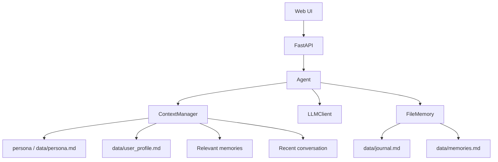

# YourTreeHole

[](README.md)
[](LICENSE)
[](pyproject.toml)
[](https://github.com/Chenypovo/YourTreeHole/actions/workflows/ci.yml)

YourTreeHole is a learning project for building a personal AI treehole.

It is not a task-execution agent or a pet game. The project explores a more focused question: when people use AI as a private place to talk, how can the AI keep remembering their thoughts, preferences, emotional context, and important life events over a long period of time?

## Goal

Most chat models eventually forget earlier context once the conversation grows too long. YourTreeHole tries to be a simpler, memory-focused treehole:

- Listen to the user carefully.
- Store raw conversations locally.
- Extract durable long-term memories from conversations.
- Naturally bring up important previous events when a new session starts.
- Let the user inspect, add, and delete memories from the web UI.

This is still a personal learning project, not a production-ready product.

## Examples

When a new session starts, Murphy can remember what the user shared before and naturally ask about recent progress.


In normal conversations, Murphy behaves more like a quiet treehole than a task agent.


## Features

[](#local-data)
[](#quick-start)
[](#local-data)

- **Web chat UI**: the main interface is the web UI, not the CLI.
- **Raw journal**: every conversation turn is saved locally to `data/journal.md`.
- **Long-term memory**: important information is summarized into `data/memories.md`.
- **User profile**: stable user information is maintained in `data/user_profile.md`.
- **Relevant recall**: recent and relevant memories are injected into the model context.
- **Proactive greeting**: Murphy can mention unresolved events when a new session starts.
- **Custom persona**: users can define the treehole's personality on first startup.
- **Web memory management**: users can view, manually add, and delete long-term memories from the sidebar.

## Quick Start

Start in three steps:

1. Clone the project and enter the directory.
2. Install dependencies and copy `.env.example`.
3. Fill in your API key and run the web server.

```bash
git clone https://github.com/Chenypovo/YourTreeHole.git
cd YourTreeHole
pip install -e ".[dev]"
cp .env.example .env
```

Edit `.env` with your OpenAI-compatible API settings:

```env
OPENAI_BASE_URL=https://api.openai.com/v1
OPENAI_API_KEY=your-api-key-here
OPENAI_MODEL=gpt-4.1-mini
```

Start the web app:

```bash
python app.py
```

Then open:

```text
http://127.0.0.1:7860/
```

## Configuration

Non-secret settings live in `config/settings.toml`:

```toml
[llm]
# base_url = "https://api.z.ai/api/coding/paas/v4"
# model = "glm-5.1"

[persona]
path = "persona.md"

[memory]
data_dir = "./data"
enable_gating = true
profile_update_interval = 5
```

Do not put API keys in `config/settings.toml`. API keys should stay in your local `.env`.

## Local Data

Conversation data is stored locally under `data/` by default:

```text
data/
├── journal.md        # raw conversation journal
├── memories.md       # long-term memories
├── user_profile.md   # user profile
└── persona.md        # custom treehole personality
```

These files contain the user's private data and should not be committed to the repository.

## Architecture



The core idea is: `journal.md` stores the raw source of truth, `memories.md` stores durable long-term memories, and `user_profile.md` stores a structured summary of the user.

## About The CLI

Earlier versions included CLI commands, but the current direction is a web-first treehole. Memory inspection, manual memory edits, session reset, and persona setup should live in the web UI first.

## Status

This is a personal learning project. The current focus is making long-term memory, user profiling, context recall, and local data management clear and reliable before polishing the web experience further.

## License

MIT
