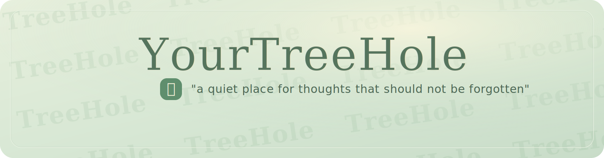
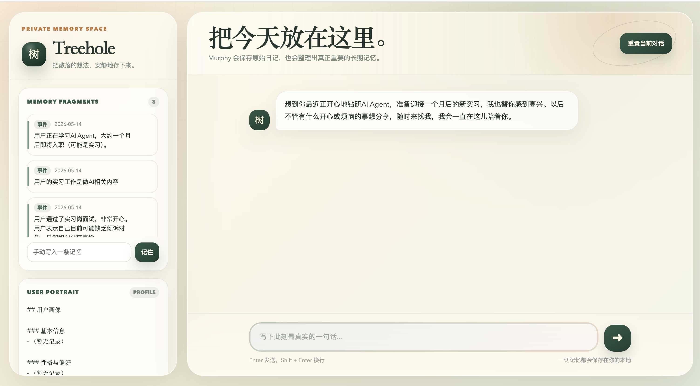
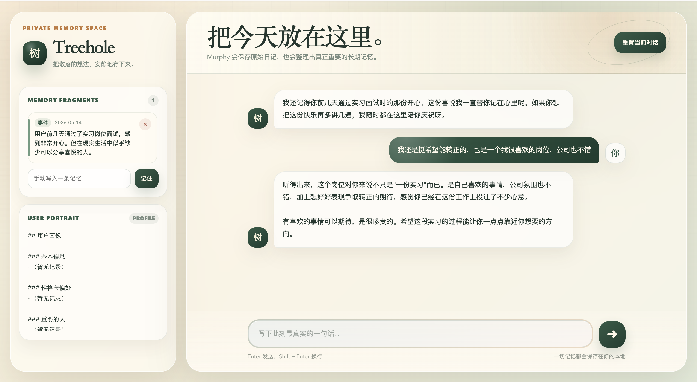
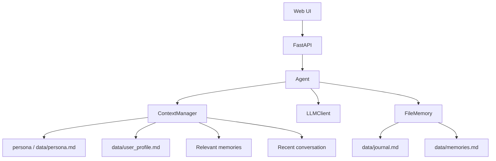

# YourTreeHole

[](README.en.md)
[](LICENSE)
[](pyproject.toml)
[](https://github.com/Chenypovo/YourTreeHole/actions/workflows/ci.yml)

YourTreeHole 是一个学习用的 AI 树洞项目。

它不是任务型 agent，也不是宠物养成应用。这个项目想探索的是：当用户把 AI 当作树洞时，AI 如何在很长时间里持续记住用户说过的话、状态、偏好和重要经历。

## 项目目标

普通聊天模型经常受上下文长度限制影响，聊久了就会忘记之前说过的事。YourTreeHole 的目标是做一个更单纯的树洞：

- 认真听用户说话。
- 把原始对话保存在本地。
- 从对话里整理出长期记忆。
- 在新会话开始时，能自然想起之前提到过的重要事情。
- 让用户可以在网页端查看、补充、删除自己的记忆。

这个项目还在学习和实验阶段，不是成熟产品。

## 示例

重新开启对话时，Murphy 可以根据之前的记忆主动问起近况。



日常聊天时，它更像一个安静的树洞，而不是任务型 agent。



## 现在支持什么

[](#本地数据)
[](#快速开始)
[](#本地数据)

- **Web 对话界面**：主要入口是网页端，而不是 CLI。
- **原始日记**：每轮对话会保存到本地 `data/journal.md`。
- **长期记忆**：重要信息会整理到 `data/memories.md`。
- **用户画像**：稳定信息会沉淀到 `data/user_profile.md`。
- **相关召回**：回复前会召回最近和相关的长期记忆。
- **主动问候**：启动时可以根据未闭环事件自然问起近况。
- **自定义人格**：首次使用时可以定义树洞的性格，设定保存在本地。
- **网页端记忆管理**：可以在侧边栏查看、手动添加、删除长期记忆。
- **Telegram 接入**：可选 Telegram Bot 入口，和 Web 共享同一套本地记忆。

## 快速开始

三步启动：

1. 克隆项目并进入目录。
2. 安装依赖并复制 `.env.example`。
3. 填入 API key 后运行 Web 服务。

```bash
git clone https://github.com/Chenypovo/YourTreeHole.git
cd YourTreeHole
pip install -e ".[dev]"
cp .env.example .env
```

编辑 `.env`，填入你的 OpenAI-compatible API 配置：

```env
OPENAI_BASE_URL=https://api.openai.com/v1
OPENAI_API_KEY=your-api-key-here
OPENAI_MODEL=gpt-4.1-mini
```

启动 Web 版本：

```bash
python app.py
```

然后打开：

```text
http://127.0.0.1:7860/
```

### Docker（推荐）

需要先安装 [Docker Desktop](https://www.docker.com/products/docker-desktop/)。

```bash
git clone https://github.com/Chenypovo/YourTreeHole.git
cd YourTreeHole
cp .env.example .env
# 编辑 .env 填入你的 API key
docker compose up -d
```

打开 `http://localhost:7860`。对话数据保存在本地 `data/` 目录，重启不丢失。

## 配置

非敏感配置放在 `config/settings.toml`：

```toml
[llm]
# base_url = "https://api.z.ai/api/coding/paas/v4"
# model = "glm-5.1"

[persona]
path = "persona.md"

[memory]
data_dir = "./data"
enable_gating = true
profile_update_interval = 5

[telegram]
enabled = false
allowed_user_ids = []
reply_mode = "final"
```

## Telegram Bot（可选）

Telegram 入口默认关闭，并且必须配置用户白名单，避免陌生人把消息写进你的本地记忆。

```bash
pip install -e ".[telegram]"
```

在 `.env` 里填入 BotFather 给你的 token：

```env
TELEGRAM_BOT_TOKEN=your-telegram-bot-token-here
```

在 `config/settings.toml` 里启用，并填入你自己的 Telegram user id：

```toml
[telegram]
enabled = true
allowed_user_ids = [123456789]
reply_mode = "final"
```

启动：

```bash
treehole-telegram
```

当前 Telegram 版本只做单用户私人树洞。支持 `/memories`、`/remember`、`/forget`、`/profile`、`/reset confirm`。

## 本地数据

所有对话数据默认保存在本地 `data/` 目录：

```text
data/
├── journal.md        # 原始对话日记
├── memories.md       # 长期记忆
├── user_profile.md   # 用户画像
└── persona.md        # 用户自定义树洞性格
```

这些文件是用户自己的私密数据，不应该提交到仓库。

## 架构



核心思路是：`journal.md` 保存原始事实，`memories.md` 保存长期记忆，`user_profile.md` 保存阶段性画像。画像和记忆都可以更新，但原始日记是更可靠的 source of truth。

## 关于 CLI

早期版本里有 CLI 命令，但现在的主要方向是 Web 端树洞。记忆查看、手动添加、删除、重置会话、人格设置这类操作会优先放到网页端。

## 项目状态

这是一个个人学习项目。当前重点是把长期记忆、用户画像、上下文召回和本地数据管理做清楚，再继续完善 Web 体验和记忆质量。

## License

MIT
